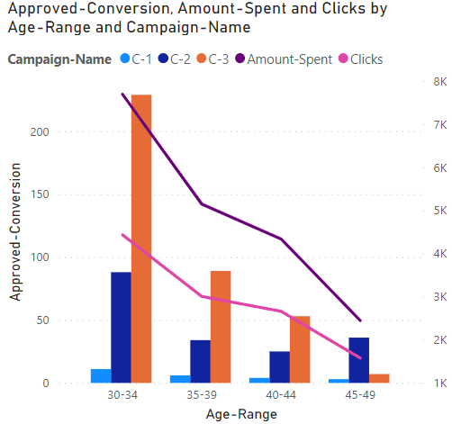
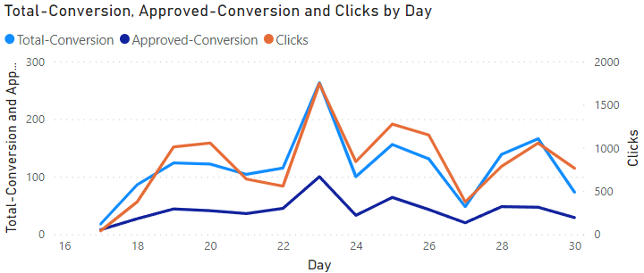
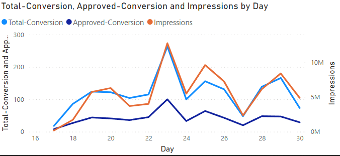
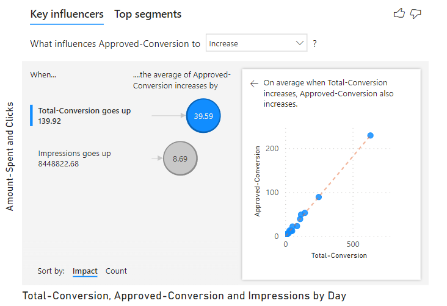

# Facebook Ad Campaign Analysis using Power BI


Analyzing advertisement metrics helps determine if we're getting a positive return on investment from our advertisement campaigns. This project examines how advertisements affect people across different age ranges, genders, and campaign timing to help marketers target the most responsive audiences.

## Problem Statement

Create a comprehensive dashboard using Facebook leads and campaigns data to analyze campaign performance and recommend changes to improve conversion rates across products.

## Solution Overview

This Power BI dashboard provides interactive data visualization to break down complex advertising data into manageable insights, helping businesses optimize their targeting strategies and achieve better ROI.

## Dashboard Components

### 1. Approved Conversion, Amount Spent and Clicks by Age Range and Campaign



This line and clustered column chart displays:
- Age range vs. approved conversions
- Amount spent and clicks segmented by age groups
- Campaign performance across different demographics

### 2. Total Conversion and Approved Conversion by Day



This line chart shows:
- Daily performance trends for total and approved conversions
- Click patterns over the campaign period
- Optimal timing for campaign launches

### 3. Conversion and Impressions Analysis



This visualization demonstrates:
- Relationship between impressions and conversions
- Daily impression trends
- Conversion efficiency over time

### 4. Key Influencers



The Key Influencers tab provides:
- Key factors affecting approved conversions
- Statistical significance of each influencer
- Data distribution through scatter plots
- Interactive analysis of different conversion factors

### Interactive Filters

The dashboard includes two slicers for dynamic filtering:
- **Campaign Filter**: Filter between campaigns C-1, C-2, and C-3
- **Gender Filter**: Analyze performance by gender or view combined data

## Key Insights & Recommendations

### Audience Targeting
- **Younger audiences** show higher conversion rates and should be prioritized in budget allocation
- Focus advertising spend on age groups with the highest conversion potential

### Gender-Based Timing Strategy
- **Female audiences** respond better to:
  - Early campaign days
  - Weekend advertising (higher engagement on Saturdays and Sundays)
- **Male audiences** show better response during:
  - Weekday campaigns
  - Consistent weekday engagement patterns

### Campaign Optimization
- **Early campaign momentum** is crucial for female audience engagement
- **Impression volume** directly correlates with conversion rates
- **Weekend vs. weekday** strategies should be gender-specific for optimal results

### Budget Allocation Recommendations
- Increase budget allocation for younger demographics
- Implement gender-specific scheduling:
  - Female-targeted ads: Early campaign days + weekends
  - Male-targeted ads: Consistent weekday presence
- Monitor impression-to-conversion ratios for campaign optimization

## Dataset Information

The dataset contains 15 attributes from an anonymous organization's social media ad campaign:

**Key Features:**
- `ad_id`: Unique identifier for each advertisement
- `campaign_id`: Campaign identification number
- `age`: Target audience age
- `gender`: Target audience gender
- `interest(1,2,3)`: Interest category codes based on Facebook profiles
- `impressions`: Number of times ad was displayed
- `clicks`: Number of ad clicks
- `spent`: Amount paid to Facebook for ad placement
- `total_conversion`: People who inquired about the product
- `approved_conversion`: People who purchased the product


## Data Sources

- **Dataset**: [Facebook Ad Campaign Data - Kaggle](https://www.kaggle.com/madislemsalu/facebook-ad-campaign)
- **Analysis Reference**: [Facebook Ad Analysis Introduction - Kaggle](https://www.kaggle.com/chrisbow/an-introduction-to-facebook-ad-analysis-using-r/data)

## Files Structure

```
├── Approved-Conversion-Amount-SPent-and-Clicks-by-Age-Range-and-Campaign-Range-Plot.png
├── Campaign-Name-Slicer.png
├── Gender-Slicer.png
├── Key-Influencers.png
├── Total-Conversion-Approved-Conversion-and-Clicks-by-Day-Plot.png
├── Total-Conversion-Approved-Conversion-and-Impressions-by-Day-Plot.png
├── Facebook-ad-campaign-analysis.pbix
├── fb_analysis.ipynb
├── model.ipynb
├── testingModel.ipynb
├── data/
├── models/
└── results/
```

## Getting Started

1. Download the `Facebook-ad-campaign-analysis.pbix` file
2. Open with Microsoft Power BI Desktop
3. Explore the interactive dashboard
4. Use slicers to filter data by campaign and gender
5. Analyze key influencers for deeper insights

---

*This analysis helps optimize Facebook advertising campaigns through data-driven insights and targeted recommendations.*
